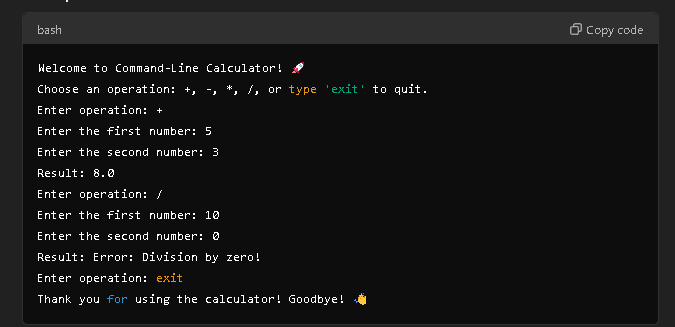

---

# Command-Line Calculator in Ruby 🚀

A simple command-line calculator built in Ruby that supports basic arithmetic operations like addition, subtraction, multiplication, and division. This calculator allows users to perform calculations interactively in the terminal or command prompt.

## Features ✨
- Supports basic operations: `+`, `-`, `*`, `/`.
- Handles division by zero with an error message.
- Interactive command-line interface.
- Repeats the calculation loop until the user decides to exit.

## Prerequisites 🔧
- Ruby (version 2.x or higher) installed on your system.

## CLI 🔧



## Installation 🛠️

1. **Clone the repository**:
   ```bash
   git clone https://github.com/chrohangurjar/command-line-calculator.git
   ```
   
2. **Navigate to the project folder**:
   ```bash
   cd command-line-calculator
   ```

3. **Run the program**:
   In your terminal, run the following command to start the calculator:
   ```bash
   ruby calculator.rb
   ```

## Usage 📱

Once the program starts, you will be prompted to choose an operation. The available operations are:
- `+` (Addition)
- `-` (Subtraction)
- `*` (Multiplication)
- `/` (Division)

You will also be asked to input two numbers for the calculation. After displaying the result, the program will prompt you again for the next operation or allow you to exit by typing `exit`.

### Example:

```bash
Welcome to Command-Line Calculator! 🚀
Choose an operation: +, -, *, /, or type 'exit' to quit.
Enter operation: +
Enter the first number: 5
Enter the second number: 3
Result: 8.0
Enter operation: /
Enter the first number: 10
Enter the second number: 0
Result: Error: Division by zero!
Enter operation: exit
Thank you for using the calculator! Goodbye! 👋
```

## Contributing 🤝

If you would like to contribute to this project, feel free to fork the repository, make improvements, and submit a pull request!

### Guidelines:
- Ensure your code is clean and well-documented.
- Test your code to ensure it works as expected.

## License 📜

This project is licensed under the MIT License - see the [LICENSE](LICENSE) file for details.

---

### Contact ✨

For any queries, you can reach me at:  
- Email: [Your Email]
- GitHub: [Your GitHub Profile](https://github.com/chrohangurjar)

---

### Acknowledgements 💡

- Ruby for being a fantastic language to develop this simple tool.

---
